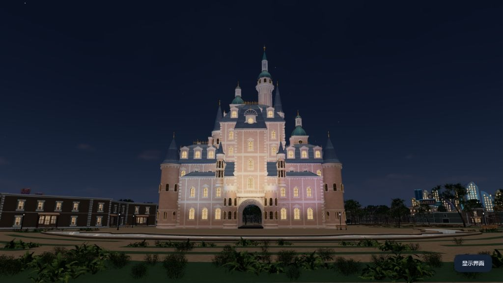
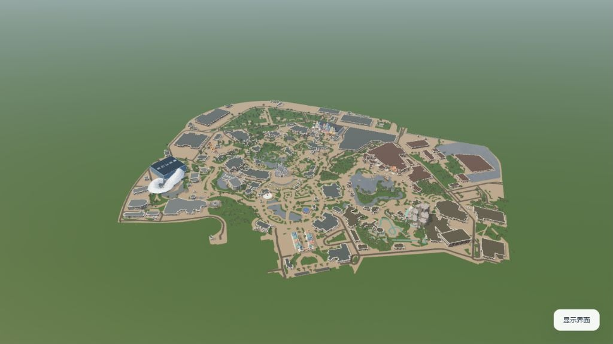
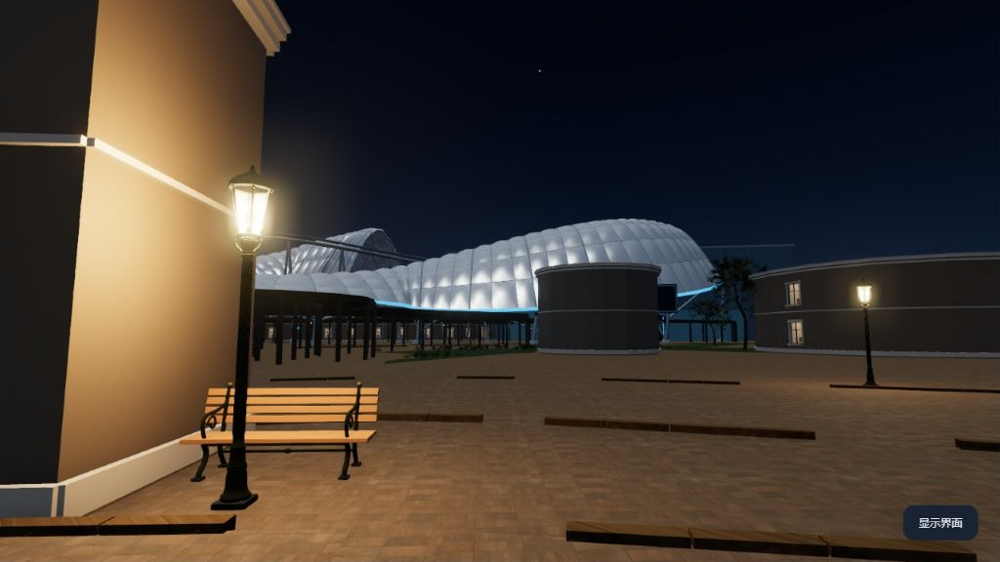
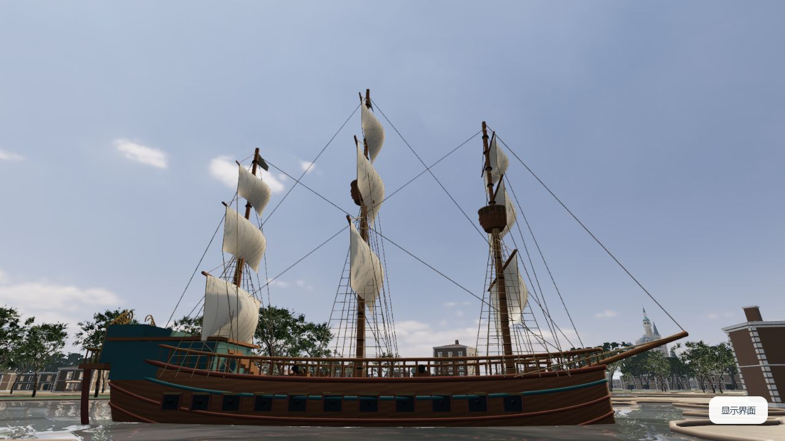
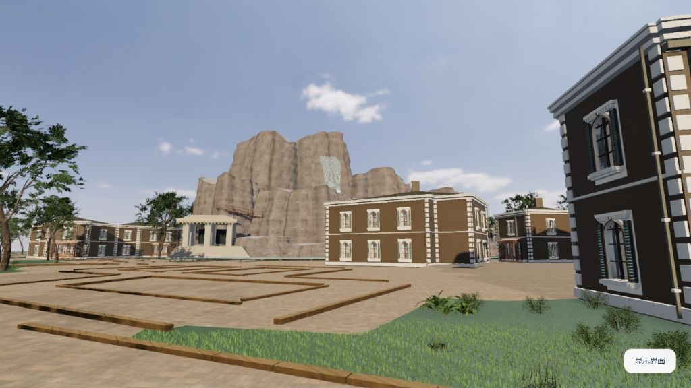
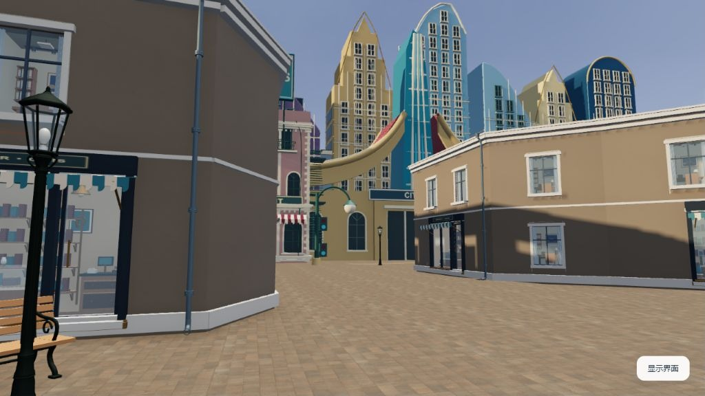
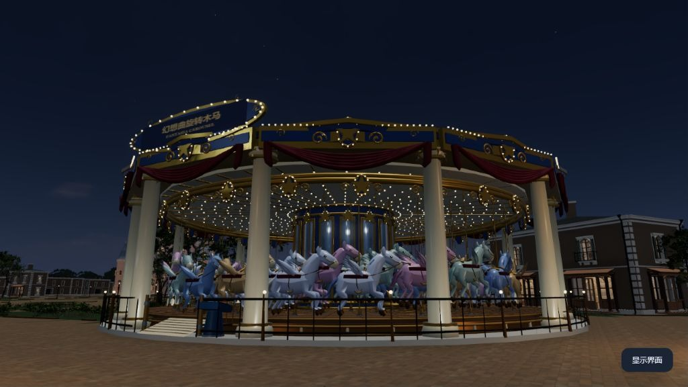
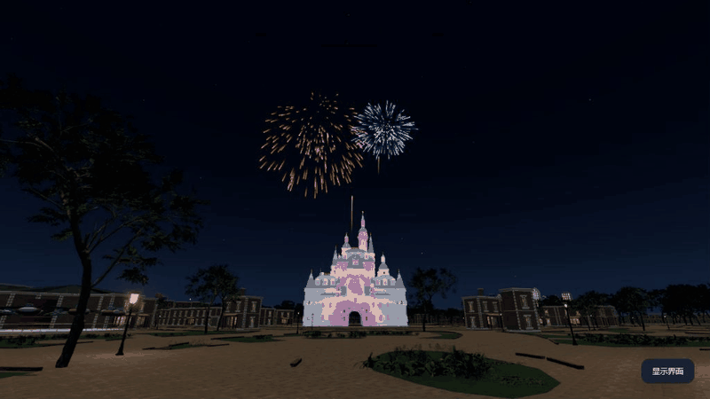
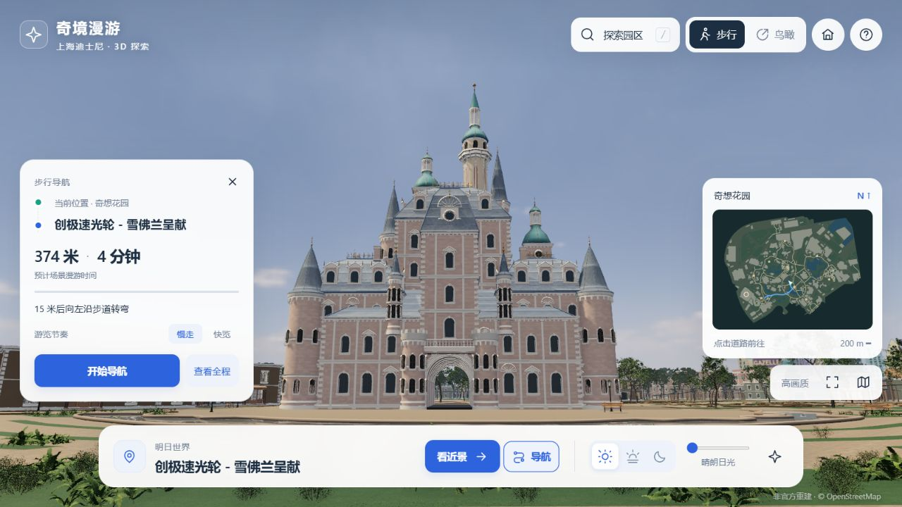

<div align="center">

# Wonder Walk · Shanghai Disneyland

**An unofficial, open-source 3D park to explore on foot, from above, and after dark.**

[](https://github.com/JohnnyGuo132/shanghai-disney-explorer/actions/workflows/ci.yml)
[](https://github.com/JohnnyGuo132/shanghai-disney-explorer/releases/latest)
[](./LICENSE.md)

[**Try it online**](https://johnnyguo132.github.io/shanghai-disney-explorer/) · [Download](https://github.com/JohnnyGuo132/shanghai-disney-explorer/releases/latest) · [Quick start](#quick-start) · [User guide](./docs/USER_GUIDE.md) · [简体中文](./README.md)

</div>

[](./docs/media/showcase/hero-castle.jpg)

Walk between landmarks, pull back to see the park, then stay for the castle lights and fireworks. Explore online or run Wonder Walk locally in your browser, with its models, textures, rendering libraries, and decoders included.

## Around the park

<table>
  <tr>
    <td width="50%"><a href="./docs/media/showcase/park-overview.jpg"></a></td>
    <td width="50%"><a href="./docs/media/showcase/tron.jpg"></a></td>
  </tr>
  <tr>
    <td align="center">The park from above</td>
    <td align="center">TRON · Tomorrowland</td>
  </tr>
  <tr>
    <td><a href="./docs/media/showcase/treasure-cove.jpg"></a></td>
    <td><a href="./docs/media/showcase/roaring-mountain.jpg"></a></td>
  </tr>
  <tr>
    <td align="center">Treasure Cove</td>
    <td align="center">Roaring Mountain · Adventure Isle</td>
  </tr>
  <tr>
    <td><a href="./docs/media/showcase/zootopia.jpg"></a></td>
    <td><a href="./docs/media/showcase/carousel.jpg"></a></td>
  </tr>
  <tr>
    <td align="center">Zootopia</td>
    <td align="center">Fantasia Carousel</td>
  </tr>
</table>

## Stay for the night show

[](./docs/media/showcase/fireworks.gif)

An approximately 60-second sequence brings together fireworks, castle lighting, projection, and smoke. Outside the show, switch between daylight, twilight, and night. Stars and moon phase are calculated for the scene's Shanghai date, while daylight and night follow the time setting.

*All images and the animation on this page are captured from the running v1.0.3 application. Click an image to open it at full size. Appearance varies with hardware, viewport, and quality settings. See [Capture notes](./docs/SHOWCASE.md).*

## Explore your way

| Experience | What you can do |
| --- | --- |
| **8 themed lands, 22 main destinations** | Search for a landmark or click a building to move to a nearby viewing point. |
| **Walk or fly above the park** | Use ground-level movement, close-up views, continuous zoom into aerial mode, and a minimap. |
| **Follow a route** | Preview a walking route with distance and time estimates, then start, pause, or resume automatic walking. |
| **Watch the details** | Explore architectural features, planting, paving, and street furniture; selected rides offer normal, slow, and paused animation. |
| **Change the atmosphere** | Move through daylight and night, or take a place in front of the castle for the show. |

[](./docs/media/showcase/navigation.jpg)

**Controls:** drag to look around, scroll to zoom, use `W A S D` or arrow keys to walk, and hold `Shift` to move faster. Press `/` to search and `Esc` to dismiss panels or interrupt automatic movement. The application interface is currently in **Simplified Chinese**; see the [user guide](./docs/USER_GUIDE.md) for detailed controls.

## Quick start

### Open it online

Visit **[Wonder Walk](https://johnnyguo132.github.io/shanghai-disney-explorer/)** — **no Node.js installation or source download is needed**. Use a browser with **WebGL 2** and **hardware acceleration**; desktop mouse and keyboard are recommended.

The first visit downloads approximately **30 MB** of models and textures. Keep the page open while they load; loading time depends on your network and device.

### Run it locally

Install **[Node.js 22+](https://nodejs.org/)**, then run:

```sh
git clone https://github.com/JohnnyGuo132/shanghai-disney-explorer.git
cd shanghai-disney-explorer
node scripts/serve.mjs
```

Open [http://127.0.0.1:4173/](http://127.0.0.1:4173/) and wait for the scene to load. No `npm install`, build step, API key, or external asset CDN is needed. Keep the terminal running while exploring; press `Ctrl+C` to stop.

**Prefer a ZIP?** Open the [latest release](https://github.com/JohnnyGuo132/shanghai-disney-explorer/releases/latest), download the named `shanghai-disney-explorer-v…-source.zip` attachment, extract it, and run `node scripts/serve.mjs` in that folder. Downloads are public. See [release packaging](./docs/RELEASING.md) for the static website archive and checksum verification, or [support](./SUPPORT.md) for startup help.

The online site deploys automatically from `main`; download packages preserve specific release versions. See the [GitHub Pages deployment guide](./docs/DEPLOYMENT.md) to host your own copy.

## Build on it

`dist/` contains the editable application and all runtime assets. `scripts/` contains the local server, checks, tests, and release packager. There is no frontend build step.

```sh
npm run check
npm test
```

Issues and pull requests are welcome. Start with the [contribution guide](./CONTRIBUTING.md) and [architecture](./docs/ARCHITECTURE.md), browse the [roadmap](./docs/ROADMAP.md), or [report an issue](https://github.com/JohnnyGuo132/shanghai-disney-explorer/issues/new/choose). For security concerns, use the [private reporting channel](./SECURITY.md). Changes are recorded in the [changelog](./CHANGELOG.md).

**Scope:** park outlines use OpenStreetMap data, while buildings and landscapes are approximate reconstructions. Interiors cover selected windows and furnishings; this is not a survey-grade replica or an official guide. There are no live queues, ticketing, operating data, or full ride simulations, and broad mobile-device validation is still pending. See [known limits](./docs/ROADMAP.md) and [performance notes](./docs/PERFORMANCE.md).

## License and acknowledgements

Original project content is available under the **[MIT license](./LICENSE.md)**. Third-party software, assets, and data retain their own terms; they are not covered by the project's MIT grant. See the [third-party notices](./THIRD_PARTY_NOTICES.md) and [asset credits](./dist/credits.html) for sources and attribution.

Thanks to Three.js, OpenStreetMap contributors, Poly Haven, ambientCG, HYG, NASA SVS, and the authors of the bundled libraries and assets.

Wonder Walk is not affiliated with or endorsed by Disney or Shanghai Disney Resort. Names, trademarks, and third-party likenesses belong to their respective rights holders.
