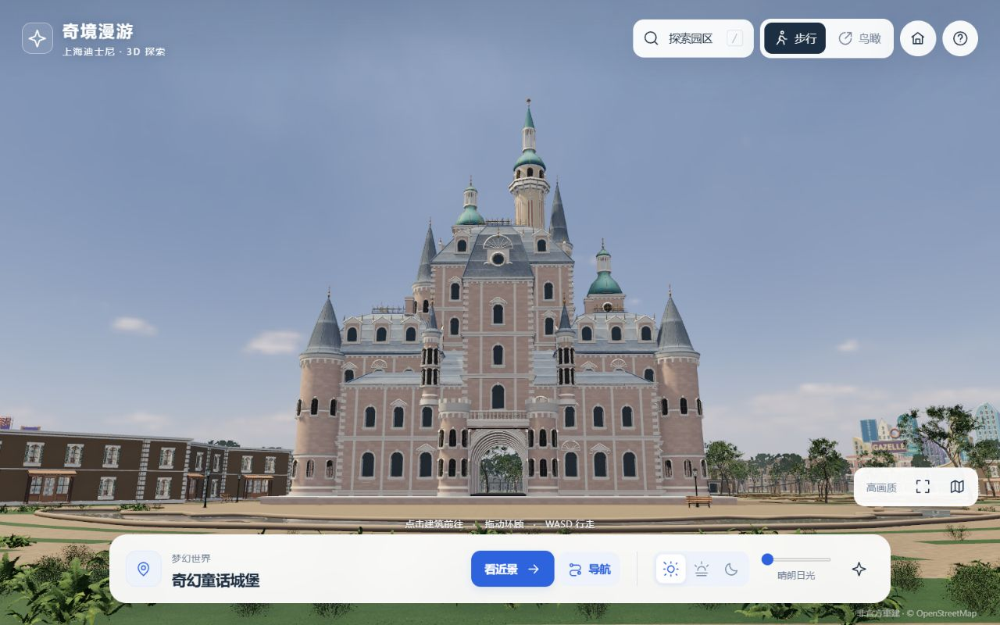
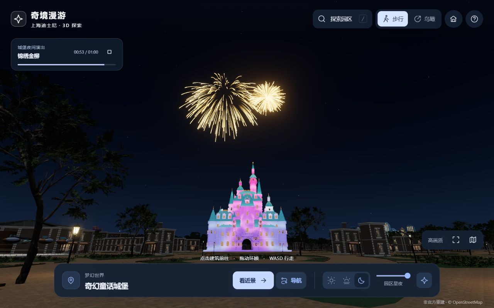
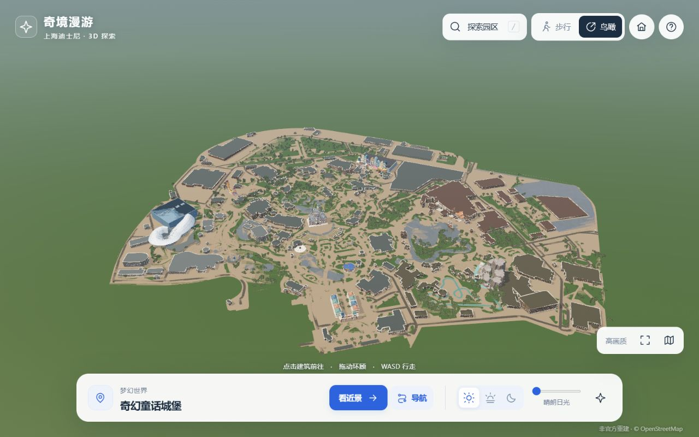

<div align="center">

# 奇境漫游 · 上海迪士尼

**沿着步道探索园区，在城堡前等待夜幕与烟花。**

浏览器三维漫游 · 昼夜光影 · 场景导航 · 城堡演出

[开始体验](#开始体验) · [操作指南](./docs/USER_GUIDE.md) · [版本记录](./CHANGELOG.md) · [English](./README.en.md)

</div>



## 关于项目

奇境漫游是一款以上海迪士尼园区为主题的非官方三维探索应用。你可以从全园鸟瞰落到地面步道，走近地标与游乐设施，切换日光、暮色和星夜，观看城堡灯光与烟花演示。

**v1.0.3 为首次公开开源发行。** 可以直接浏览、克隆源码或匿名下载 Release，在本机运行无需账号、API Key 或外部素材 CDN。GitHub Pages 尚未启用；本次公开提供源码与下载包。

本次发行明确原创内容的 MIT 许可并完善公开协作文档，场景继承 v1.0.2 的城堡接地修复与此前的缩放稳定性修复。第三方库、素材和数据继续遵守各自许可。见 [v1.0.3 发行说明](./docs/releases/v1.0.3.md)。

园区地面轮廓来自 OpenStreetMap，建筑与景观依据公开资料进行近似重建。它不是测绘级 1:1 复刻，也不是官方导览；路线、内景、演出和设施动画用于虚拟场景体验。

## 可以体验什么

| 体验 | 已实现内容 |
| --- | --- |
| 全园探索 | 8 个主题区域、22 个主要目的地，另可点击沿街建筑 |
| 自由漫游 | 地面行走、建筑近景、可连续拉远的鸟瞰、小地图 |
| 场景导航 | 从当前位置规划步道路线，显示距离与预计时间，支持自动行走、暂停和继续 |
| 昼夜变化 | 日光、暮色、星夜；太阳、月相与星空根据上海日期和时间计算 |
| 城堡夜间演出 | 多种烟花形态、分区灯光、投影与烟雾的约一分钟演示 |
| 细节观察 | 建筑窗饰与檐口、植物与铺地、路灯座椅；部分游乐设施支持运行、慢速与定格 |
| 本地运行 | 模型、纹理、渲染库与解码器随包分发，无需安装 npm 依赖 |

<table>
  <tr>
    <td></td>
    <td></td>
  </tr>
  <tr>
    <td align="center">城堡夜间演出</td>
    <td align="center">全园鸟瞰</td>
  </tr>
</table>

截图来自 v1.0.0 实际浏览器画面；不同显卡、窗口尺寸和画质设置会影响效果。

## 开始体验

1. 打开 [v1.0.3 Release](https://github.com/JohnnyGuo132/shanghai-disney-explorer/releases/tag/v1.0.3)，无需登录即可下载。
2. 下载并解压 `shanghai-disney-explorer-v1.0.3-source.zip`。
3. 安装 [Node.js](https://nodejs.org/) **22 或更新版本**。在解压后的项目目录打开终端，运行：

```sh
npm run dev
```

打开终端显示的 **http://127.0.0.1:4173/**，等待模型载入即可游览。无需 `npm install`，也没有前端构建步骤。请保持终端运行；结束游览后按 `Ctrl+C` 关闭本地服务。

若 PowerShell 阻止执行 `npm.ps1`，可直接运行等效命令：

```sh
node scripts/serve.mjs
```

端口被占用时使用 `npm run dev -- --port 4184`。不要直接双击 HTML 文件；浏览器需要通过 HTTP 加载模型与模块。

Release 还包含面向部署的 `website.zip`、`SHA256SUMS.txt` 和版本清单。普通体验优先选择上面的 `source.zip`；区别与校验方法见 [发行说明](./docs/RELEASING.md)。

也可以直接克隆仓库：

```sh
git clone https://github.com/JohnnyGuo132/shanghai-disney-explorer.git
cd shanghai-disney-explorer
npm run dev
```

## 基本操作

| 操作 | 作用 |
| --- | --- |
| 拖动场景 | 环顾四周；鸟瞰时旋转视角 |
| 滚轮 | 拉近或拉远；地面持续拉远后进入鸟瞰 |
| `W A S D` / 方向键 | 沿场景步道行走，`Shift` 加速 |
| 点击场景建筑 | 移动到附近观景位置 |
| 搜索目的地 | 选择后使用「看近景」或「导航」 |
| 「导航」 | 预览路线，再开始自动行走；可以暂停、继续或查看全程 |
| 昼夜控件 / 烟花按钮 | 切换光照，或前往城堡观看演出 |
| 「高画质 / 流畅」 | 调整渲染开销 |
| `/` / `Esc` | 打开搜索 / 关闭面板并退出当前自动操作 |

完整说明与常见问题见 [操作指南](./docs/USER_GUIDE.md)。

## 运行要求与体验边界

需要支持 **WebGL 2**、开启硬件加速的现代浏览器。桌面鼠标与键盘是主要交互方式；触屏提供方向按钮，但手机与平板尚未完成广泛机型验证。

大范围植被、透明材质、阴影和烟花会增加显卡负担。建议先使用「流畅」模式，再根据设备情况切换画质。当前不承诺特定显卡的帧率、加载时长或全设备兼容性；实测范围与复测方法见 [性能与兼容性](./docs/PERFORMANCE.md)。

建筑内景目前以局部橱窗和陈设为主，许多建筑不能进入；场景没有真实排队时间、票务、营业数据或设施乘坐模拟。详见 [已知限制与路线图](./docs/ROADMAP.md)。

## 项目结构

```text
dist/                可直接运行的网站源码与完整本地素材
  index.html         全园漫游入口
  explore.js         界面、镜头、导航状态与输入
  world-*.js         场景、建筑、植被、设施、灯光与烟花
  assets/            模型、纹理、地理数据、星表与来源记录
  vendor/            随附渲染库与解码器
scripts/             本地服务、检查、测试和发行打包
docs/                操作、架构、性能与发行说明
.github/             持续检查和协作模板
```

`dist/` 同时是网站源文件与交付目录；没有隐藏的构建产物生成步骤。开发前阅读 [架构说明](./docs/ARCHITECTURE.md) 与 [贡献指南](./CONTRIBUTING.md)。

```sh
npm run check
npm test
```

## 文档与反馈

- [操作指南](./docs/USER_GUIDE.md)：浏览、导航、画质、常见问题。
- [架构说明](./docs/ARCHITECTURE.md)：模块职责、资源加载与运行路径。
- [性能与兼容性](./docs/PERFORMANCE.md)：验证范围与复测记录要求。
- [v1.0.3 开源发行说明](./docs/releases/v1.0.3.md)：原创内容 MIT 许可与公开下载。
- [v1.0.2 补丁说明](./docs/releases/v1.0.2.md)：城堡底板修复与验证范围。
- [v1.0.1 补丁说明](./docs/releases/v1.0.1.md)：此前的缩放闪变修复与验证范围。
- [v1.0.0 验收记录](./docs/RELEASE-VALIDATION.md)：首个正式版本检查的操作、截图与未覆盖范围。
- [发行说明](./docs/RELEASING.md)：版本、下载包、校验和与公开分发。
- [路线图](./docs/ROADMAP.md)：已知限制和后续优先级。
- [反馈与支持](./SUPPORT.md) · [安全报告](./SECURITY.md) · [贡献指南](./CONTRIBUTING.md)。

欢迎通过 [Issues](https://github.com/JohnnyGuo132/shanghai-disney-explorer/issues/new/choose) 反馈问题、讨论功能，或提交 Pull Request。安全问题请使用 [私密报告渠道](./SECURITY.md)。历史 v1.0.0–v1.0.2 文档保留了当时的私有发行记录；当前分发方式以本页与 v1.0.3 说明为准。

## 许可与致谢

项目原创内容采用 **MIT 许可**，欢迎使用、修改与贡献。第三方库、素材及数据保留各自条款，MIT 不覆盖这些第三方内容。完整范围见 [LICENSE.md](./LICENSE.md) 和 [THIRD_PARTY_NOTICES.md](./THIRD_PARTY_NOTICES.md)。

感谢 Three.js、OpenStreetMap 贡献者、Poly Haven、ambientCG、HYG、NASA SVS 及随附库与素材的作者。逐项署名、素材修改记录和精度说明保留在 [素材来源页面](./dist/credits.html)。

本项目与迪士尼及上海迪士尼度假区没有官方关联，也未获其背书。名称、商标与第三方形象的权利归各自权利人。
