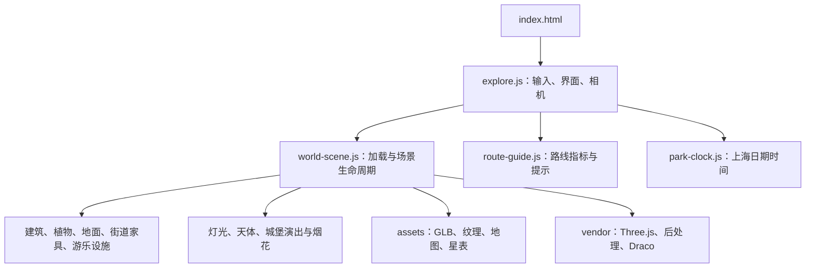

# 架构与资源

[返回项目首页](../README.md)

## 运行方式

应用是静态 ES 模块网站，使用随包提供的 Three.js 与 WebGL 渲染。`dist/` 是可编辑网站源码和运行素材的交付目录，不需要打包器或后端 API。HTML import map 将 `three` 指向本地库；模型、纹理、地理数据、天体数据和 Draco 解码器使用相对路径加载。

`scripts/serve.mjs` 用 Node.js 内置 HTTP 模块提供本地预览。它是本机开发与体验工具；本版本不提供公网站点或访问控制服务器。

## 主要职责

| 文件或目录 | 职责 |
| --- | --- |
| `dist/index.html`、`explore.html` | 全园体验入口与 UI 结构 |
| `dist/explore.js`、`explore.css` | 搜索、目的地、相机模式、路线状态、控件与响应式布局 |
| `dist/world-scene.js` | 创建场景、并行加载资源、组合细节模块、逐帧更新 |
| `dist/world-geometry.js` | 场景几何与路径辅助计算 |
| `dist/world-picking.js` | 可点击对象注册与选取 |
| `dist/route-guide.js`、`world-route-overlay.js` | 路线里程和方向提示、地面路线可视化 |
| `dist/world-buildings.js`、`world-facades.js`、`world-architectural-detail.js` | 建筑体量、窗面和建筑装饰 |
| `dist/world-flora.js`、`world-botany.js`、`world-understory.js` | 树木、花草和低矮植被 |
| `dist/world-ground-detail.js`、`world-street-furniture.js` | 铺地、路沿、路灯和座椅 |
| `dist/world-mechanical-rides.js`、`world-ride-detail.js` | 游乐设施动画与近距离机械细节 |
| `dist/world-lighting.js`、`world-celestial.js`、`park-clock.js` | 光照、天体显示与时间 |
| `dist/world-fireworks.js`、`fireworks-compiler.js`、`world-firework-smoke.js`、`world-castle-show.js` | 烟花编排、粒子、烟雾和城堡演出联动 |
| `dist/map.html` | 跳转到全园鸟瞰入口 |
| `dist/experience.html`、`experience.js`、`plaza.js` | 随包保留的独立城堡广场场景；主体验为 `index.html` |

## 坐标与数据

地图数据存于 `dist/assets/geography/park-local.json`，来源、采集日期、投影与许可记录存于同目录 `manifest.json`。坐标由 WGS84 在主城堡附近作局部线性化，场景约定：

- 一个单位对应一米。
- X 轴向东，Z 轴向南，Y 轴向上。
- 模型位置与轮廓参考地图；缺失高度、装饰、植物和内景包含估算。

数据并不包含完整实测高程。导航图用于场景中的可行走区域判断与路线搜索，不能代替真实园区通行信息。

## 模型与材质

GLB 模型、PBR 纹理与 HDR 环境随发行包保留。部分模型使用 Draco 压缩，由本地解码器处理。近景细节和植被使用实例化、距离裁剪或不同细节层级减少渲染开销。

交付物包含浏览器源代码与运行资产；不宣称包含所有资产的原始建模工程、照片资料或生成流水线。修改模型前先查看 `assets/landmarks/` 中的来源与尺寸记录，避免破坏旋转方向、可点击范围和路径关系。

## 添加或替换内容

1. 确认素材的来源与使用许可，保留原始署名，并更新对应来源记录。
2. 使用相对路径放入 `dist/assets/`，保持 Linux 文件名大小写一致。
3. 对地标变更同步检查布局、选取目标、观景点与路线终点。
4. 在白天与夜晚、地面与鸟瞰、两档画质下检查结果。
5. 运行 `npm run check` 和 `npm test`，再按 [发行说明](./RELEASING.md) 打包。

## 数据与联网边界

主场景运行使用随包数据，不接入票务、实时排队、园区账号或外部素材服务。用户主动打开素材来源链接时会访问对应外部网站。版本更新通过下载或仓库更新完成；当前没有自动更新服务。
