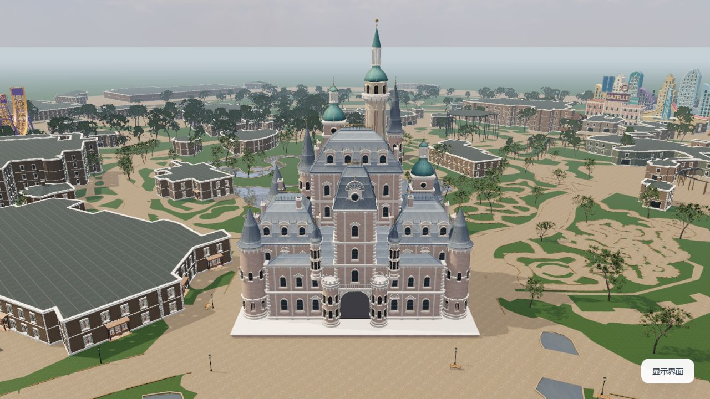
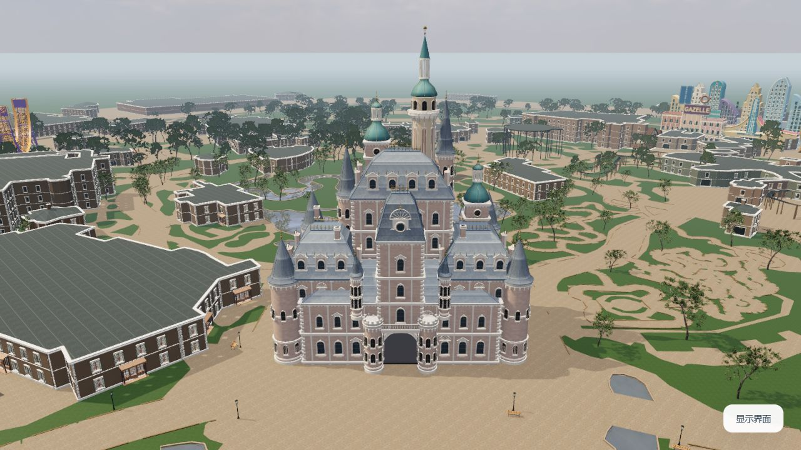

# 城堡底板与地面衔接修复

## 原因

城堡资产保留了两块矩形展示底座：砂岩底层和石灰石盖板。原始生成尺寸分别为 46.6 × 34 × 0.6 米和 47 × 34.5 × 0.14 米，随后随城堡一起缩放。它们超出建筑轮廓，形成截图中突出的浅色矩形板。

这两块底板已经合并进墙体和雕刻所用的网格。直接隐藏对应网格会同时隐藏建筑，因此修复按材质与底板八个角点精确识别三角面，仅移除两块箱体共 24 面。

## 接地处理

移除底板后，按原模型墙基高度 `0.6 × 0.98` 重新定位城堡。墙基放在园区铺地 `y = -0.025` 下方 2 厘米，避免底座消失后出现悬空缝隙；塔脚、门洞、窗饰和建筑内部地板保留。没有新增另一个矩形平台。

## 实际浏览器对照

以下为同一日期、时间、机位及画质的实际运行截图，使用当前场景渲染代码，临时检查页仅固定初始相机。检查页不随网站分发。

| 修复前 | 修复后 |
| --- | --- |
|  |  |

在当前 Windows 内置浏览器中检查了日间正面、墙脚近景、夜间正面及背面。检查范围集中于底板移除与接地，不代表测绘级重建或新增设备兼容性认证。

## 验证

- 模型从 353,775 个三角面变为 353,751 个，仅删除底板的 24 面。
- 贴图、材质与节点保留，其余墙体和雕刻几何经过解码对照。
- 18 块未修改的 Draco 压缩数据逐字节保留；两块修改网格复用原量化格点。逐个有向三角核对后，位置最大浮点舍入差为 `1.49e-8` 模型米、法线为 `0`、UV 为 `9.54e-7`、切线为 `4.77e-7`；原有退化三角仍保留。
- 修复后 GLB 为 3,304,856 字节（原为 1,816,352 字节），SHA-256 为 `0bbdb037ff231c59bf9feb6f83c0b1aa76215590f7eb3b9379563b056893ea86`。重新编码仅限两块修改网格。
- glTF Validator 无错误、无警告；压缩几何另以 Draco 解码进行核对。
- 24 项现有自动测试通过；235 个运行文件、296 条本地引用、24 个 GLB、30 个原创 JS 模块和 17 个署名文件检查通过。
- v1.0.1 的缩放与渲染稳定性修复继续保留。
